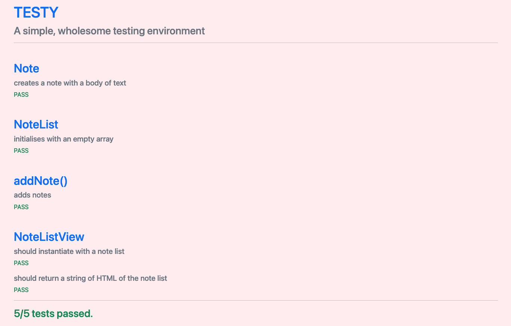

## IMPRMNCE
A vanilla Javascript notes app, with its own testing framework (Testy). Created as part of Makers Academy.

The objective of this exercise has been to build a Note taking app with just JavaScript using TDD, but with the caveat that we also have to build the testing environment ourselves.

Enter Testy, the solution  that I've build that aims to replicate the syntax from other testing solutions (e.g. Jasmine) in order to be immediately familiar to users. An example of a test is below:

    describe("Note", () => {
	    it("creates a note with a body of text", () => {
		    let sampleInput = "hello I'm a test";
		    let testNote = new Note(sampleInput);
		    isEqual(testNote.readNote(), sampleInput)
		});
	});

'./tests/run-tests.html' runs all of the given spec files, and outputs the results of the tests in the manner illustrated below:

## Usage

 - Clone this repo.
 - Use a browser to visit './index.html' to acccess the notes app. (In Progress)
 - Use a browser to visit './tests/run-tests.html' to see the tests being run.

This could be used as a template for running your own tests on JavaScript web apps.

